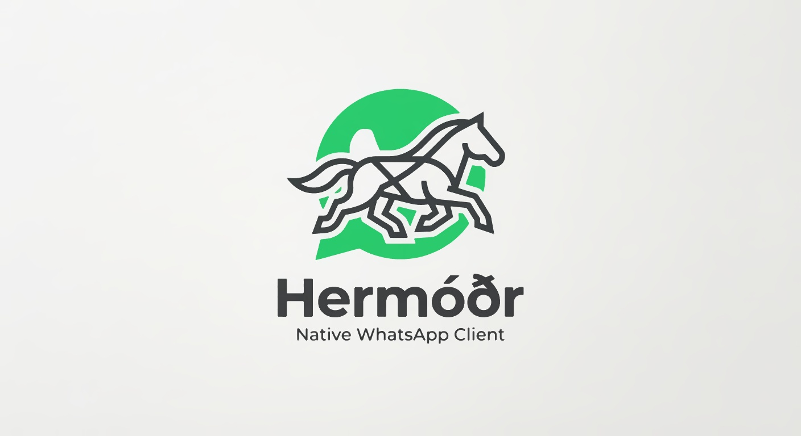

# Hermóðr



A native WhatsApp desktop client. It speaks the WhatsApp multi-device protocol
directly instead of embedding WhatsApp Web in a browser engine.

## Why

The obvious way to build a WhatsApp desktop client is to wrap WhatsApp Web in a
webview, which is what Altus (and most alternatives) do. That approach has a
cost: WhatsApp Web treats a desktop client like another browser tab, so it syncs
the account's **entire message history** into local storage and then keeps it in
memory. On a large account that means tens of gigabytes downloaded, multi-
gigabyte memory use, and a client that gets slower the more history you have.

Hermóðr takes the other path. Because it implements the protocol itself:

- **History sync is a decision this program makes.** The deep history sync is
  refused by default; recent messages, contacts and on-demand fetches still
  arrive. `accept_full_history` opts in to the old behaviour.
- **Message storage is ours.** History lives in a small SQLite database with a
  configurable retention window (24 hours and 500 messages per chat by default).
  Nothing unbounded accumulates.
- **No browser engine for WhatsApp.** No WebKit, no per-tab network processes,
  no compositing workarounds. The only webview is the one rendering this app's
  own UI.

## Measured impact

Against a real account, comparing the old webview approach with this one:

| Metric | Altus (WhatsApp Web in a webview) | Hermóðr |
| --- | --- | --- |
| CPU, idle | ~200% of one core, sustained | **~0.3%** |
| Memory, whole app | ~2.2 GB, climbing to ~23 GB | **~600 MB** |
| History downloaded at pairing | entire account (~20 GB) | none |
| Message history stored | 604k+ rows, 774 MB | bounded by retention |

Memory is the whole app. The protocol core is around 35 MB; the rest is the one
WebKit webview that renders the UI, the only place a browser engine is used. The
point is that nothing history-sized accumulates either way.

CPU was sampled with `pidstat` in 30-second windows. Altus held 130-220% of one
core the entire time and its RSS kept climbing toward the full 23 GB history, so
it never reaches a true idle. Hermóðr sits under 1% when idle.

This is not a knock on Altus. It is a good project, and a fairly optimized one;
the numbers above are a property of the approach, not of its authors. Any client
that drives WhatsApp Web inherits the web app's behaviour: it has to pull the
account's history in, and it has to keep the page holding that history alive.

The session database also needed bounding: decryption secrets for edits and
reactions default to a 30-day horizon, which grew one profile to 97 MB across
399,620 rows. The horizon now tracks the message retention window, and existing
profiles are reclaimed on startup (**97 MB → 5.8 MB**).

## The name

**Hermóðr** (Old Norse `[ˈhermˌoːðz̠]`, anglicized *Hermod*, roughly
**"HAIR-moth"**): the `ð` is a voiced *th*, as in **"the"**, so the ending
sounds like "moth" said with a *th* rather than a hard *t*.

The name is Old Norse, from `herr` ("war, host") + `móðr` ("spirit, courage,
mood"), literally **"war-spirit"**. In Norse mythology Hermóðr is a son of
Odin and the brother of Baldr, and he is best known as *the messenger*: when
Baldr is killed, Hermóðr rides Odin's horse Sleipnir for nine nights down to
Hel to plead for his brother's return. A god whose job is to carry a message
from one realm to another is a fitting namesake for a chat client.

## Architecture

```
crates/hermodr-core/    protocol client, storage, retention
  history.rs            which history-sync chunks to accept
  store.rs              SQLite message store + retention policy
  service.rs            connection lifecycle, typed event stream
src-tauri/              Tauri shell: commands and event forwarding
src/                    Svelte 5 UI (chat list, conversation, pairing)
```

`hermodr-core` is built on [`whatsapp-rust`](https://github.com/oxidezap/whatsapp-rust),
a pure-Rust implementation of the WhatsApp multi-device protocol.

## Installing

Releases ship an AppImage. Download it from the releases page, or run:

```console
curl -fsSL https://raw.githubusercontent.com/emiliano-go/hermodr/master/scripts/install.sh | sh
```

## Building

To build from a clone:

```console
scripts/install-dev.sh          # build a release and install it
scripts/install-dev.sh --dev    # start the dev server
```

Dependencies are declared in `Cargo.toml`: Tauri comes from crates.io, and
`whatsapp-rust` is pinned to a git revision because per-chunk history control
(`HistorySyncAdmission`) is newer than its last release. Cargo fetches both, so
there is nothing to clone by hand. `.cargo/config.toml` has Cargo use the system
`git`, so a global HTTPS-to-SSH rewrite still works.

Requirements: Rust 1.94+ (stable), Node with pnpm, and the usual Tauri Linux
dependencies (WebKitGTK 4.1, GTK 3). The dev script does not install system
packages; it prints what the build needs.

On Wayland, WebKitGTK's DMA-BUF renderer fails with `Gdk Error 71`. The app sets
`WEBKIT_DISABLE_DMABUF_RENDERER=1` itself, so no manual configuration is needed.

## Diagnostics

Two binaries exercise the core without the UI:

```console
cargo run -p hermodr-core --bin spike          # pair by QR, print a terminal QR
cargo run -p hermodr-core --bin service-check  # store messages, show retention
```

`spike` renders its pairing code as Unicode blocks, so it needs no image viewer.
Set `SPIKE_HISTORY=accept` to compare behaviour when the full history is allowed.

## Media

Downloaded media is written to the folder set in Settings, which defaults to the
app data directory. The asset protocol is scoped to whatever folder is
configured, so a custom location is served to the UI as well.

Attachments are read in the webview and sent base64-encoded, because a webview
cannot hand out a real filesystem path. That is fine for the images and
documents a picker is normally used for, but it is not a good fit for very large
files.

## Testing

```console
cargo test -p hermodr-core
```

## Status

Working:

- Pairing by QR, reusing the stored session on later launches
- Receiving and sending text, with quotes/replies
- Images and documents received inline, and sent from the composer
- Group and contact names, resolved from push names and group queries
- Unread counts per chat, and a read indicator on messages
- Replies in both directions, with the quoted author attributed correctly
- Deleted messages kept and shown as removed rather than vanishing
- Retention enforcement, and a configurable media folder

Not yet implemented: audio/video playback, group administration, calls,
notifications, multiple accounts, and the tray icon.

## License

MIT, see [LICENSE](LICENSE). Third party dependencies keep their own
licenses, listed in [THIRD_PARTY_NOTICES.md](THIRD_PARTY_NOTICES.md).
